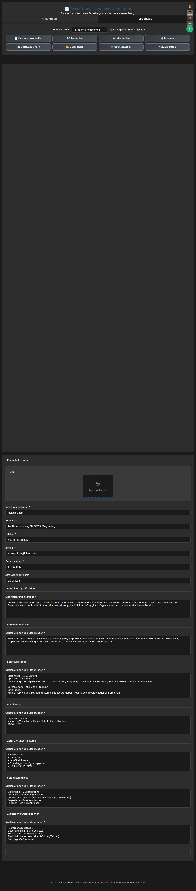
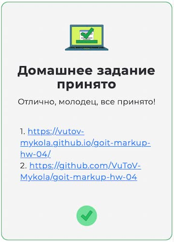
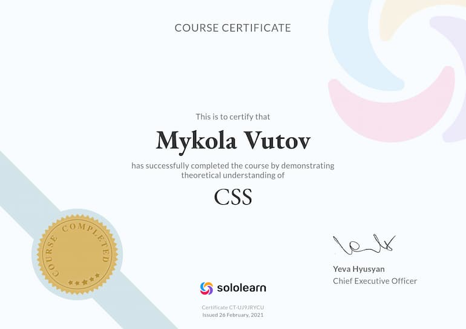

<!-- AUTOGEN:STATS -->
      

## 📸 Скріншот проекту

<!-- END:AUTOGEN -->

## Мої досягнення

 

## Мої сертифікати - Пройшов курс на Sololearn :

[SOLOLEARN](https://www.sololearn.com/certificates/CT-UJ9JRYCU)

## 📌 Завдання

- Створити репозиторій для проєкту з SVG-іконками та анімаціями.
- Додати векторні зображення у форматі SVG-спрайту.
- Реалізувати ефекти ховера та анімації переходів.
- Налаштуй **GitHub Pages** та додай посилання на живу сторінку у секцію **About**.

---

## ✅ Критерії виконання завдання

### **Проєкт**

- `«A1»` У корені проєкту є папка `images` з зображеннями.
- `«A2»` Усі векторні зображення (іконки) зібрані в SVG-спрайт `icons.svg`, який лежить у папці `images`.
- `«A3»` Усі векторні зображення оптимізовані.
- `«A4»` У корені проєкту є папка `css` з файлами стилів.
- `«A5»` Всі стилі написані в одному файлі `styles.css`, який знаходиться в папці `css`.
- `«A6»` У назвах файлів відсутні великі літери, пробіли і трансліт. Назви містять тільки літери і слова англійської мови.
- `«A7»` Вихідний код відформатований за допомогою `Prettier`.
- `«A8»` Всі зображення та текстовий контент взяті з макета.
- `«A9»` Підключений нормалізатор стилів `modern-normalize`.
- `«A10»` Всі стилі написані в одному файлі `styles.css`, який знаходиться в папці `css`.
- `«A11»` Код написаний з дотриманням **настанови**.

### **Розмітка**

- `«B1»` Для всіх іконок використовується векторна графіка у форматі `svg`.
- `«B2»` SVG-іконки експортовані правильно. При експорті обрана «група», а не сам вектор.
- `«B3»` Всі іконки з SVG-спрайту додані в HTML за допомогою тегів `<svg>` і `<use>`.
- `«B4»` В секції переваг (секція без назви з переліком переваг над `Our Team`) додані іконки.
- `«B5»` В секції `Our Team` додані іконки соцмереж.
- `«B7»` У футері додані іконки соцмереж.
- `«B8»` Виконана HTML-розмітка всіх елементів макету.
- `«B9»` Теги використані відповідно до їх семантичного змісту.

### **Оформлення**

- `«C1»` Велике зображення з ефектом затемнення (під хедером) виконано як фон. Для затемнення використовується багатошаровий фон з градієнтом.
- `«C2»` Фонове зображення в блоці під хедером не розтягується ширше свого оригінального розміру `1440рх`.
- `«C3»` У картках секції `Our Team` є постійний ефект тіні.
- `«C4»` У картках секції `Our Portfolio` є ефект тіні при ховері в будь-якому місці картки.
- `«C5»` При ховері або фокусі іконки повинні переходити в активний стан - змінювати колір, якщо це зазначено в макеті.
- `«C6»` Для всіх ефектів ховера і фокуса (колір, фон, тінь) зроблені переходи. Час - `250ms`, функція розподілу часу - `cubic-bezier(0.4, 0, 0.2, 1)`.
- `«C7»` У переходах явно зазначені анімовані властивості. Ніде немає значення `all`.
- `«C8»` В головній навігації, за допомогою псевдоелемента `::after`, зроблено підкреслення посилання поточної сторінки (на якій зараз знаходиться користувач).
- `«C9»` Оверлей з текстом на картках секції `Our Portfolio` з'являється при ховері в будь-якому місці картки.
- `«C10»` Синій оверлей в картках секції `Our Portfolio` виїжджає знизу.
- `«C11»` У псевдоелементів відсутній текстовий контент у властивості `content`. Вони використані виключно для декоративного оформлення.

---

## 🎨 Технічні особливості

### SVG Спрайт
Приклад використання іконок з SVG-спрайту:

~~~html
<svg class="icon" width="24" height="24">
  <use href="./images/icons.svg#icon-name"></use>
</svg>
~~~

### CSS Переходи
Стандартні налаштування для переходів:

~~~css
.element {
  transition: color 250ms cubic-bezier(0.4, 0, 0.2, 1);
}
~~~

### Псевдоелементи
Використання для декоративного оформлення:

~~~css
.element::after {
  content: "";
  /* декоративні стилі */
}
~~~
