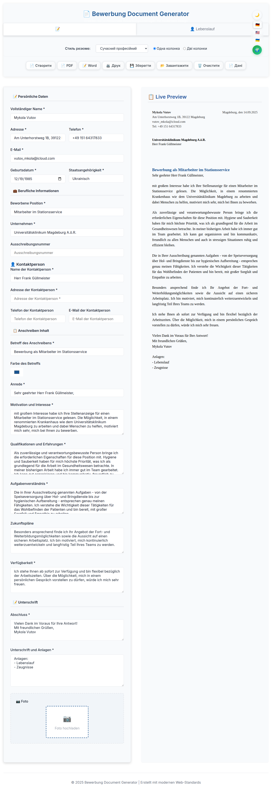

# 📄 Bewerbung Document Generator

Professional job application document generator optimized for modern recruiting systems 2025. Specifically configured for **Mitarbeiter im Stationsservice** position at Universitätsklinikum Magdeburg.

## 🌟 Features

- **📱 Mobile-First Design**: Fully responsive and optimized for mobile devices
- **🌐 Multi-Language Support**: German, English, and Ukrainian
- **🎨 Dark/Light Theme**: Automatic theme switching with localStorage persistence
- **📝 Professional Templates**: Optimized for ATS (Applicant Tracking Systems)
- **💾 Multiple Formats**: HTML, PDF, DOCX generation
- **🔄 Real-time Preview**: Live preview of documents as you type
- **📋 Form Validation**: Comprehensive form validation and error handling
- **🎯 Station Service Focus**: Specifically tailored for healthcare positions

## 🚀 Live Demo

**[Try it now on GitHub Pages](https://vutov.github.io/bewerbung-stationsservice/)**

## 🛠️ Local Setup

To run this project locally:

```bash
# Clone the repository
git clone https://github.com/vutov/bewerbung-stationsservice.git
cd bewerbung-stationsservice

# Install dependencies
npm install

# The setup script will automatically copy required libraries
# You can also run it manually:
npm run setup-libs

# Start local server
npm start
# or
python -m http.server 8000
```

The project will be available at `http://localhost:8000`

## 📱 Mobile Features

- **Responsive Design**: Adapts perfectly to all screen sizes
- **Mobile Menu**: Intuitive hamburger menu for easy navigation
- **Touch-Friendly**: Optimized for touch interactions
- **iOS Zoom Prevention**: Prevents unwanted zoom on form inputs
- **Smooth Scrolling**: Enhanced scrolling experience on mobile devices

## 🛠️ Technologies Used

- **Frontend**: Vanilla HTML5, CSS3, JavaScript (ES6+)
- **Styling**: CSS Grid, Flexbox, CSS Custom Properties
- **Icons**: Unicode emojis for cross-platform compatibility
- **Fonts**: Inter font family for modern typography
- **Deployment**: GitHub Pages (static hosting)

## 📁 Project Structure

```
bewerbung-stationsservice/
├── index.html              # Main application file
├── config.js               # Configuration settings
├── utils.js                # Utility functions
├── locales/                # Translation files
│   ├── de.json            # German translations
│   ├── en.json            # English translations
│   └── uk.json            # Ukrainian translations
├── data/                   # Sample data files
│   ├── lebenslauf_data.json
│   ├── lebenslauf_data_de.json
│   └── lebenslauf_data_en.json
├── templates/              # Document templates
│   ├── bewerbung.html     # Application letter template
│   └── lebenslauf.html    # CV template
├── package.json           # Project configuration
└── README.md              # This file
```

## 🎯 Target Position

This generator is specifically optimized for:
- **Position**: Mitarbeiter im Stationsservice
- **Company**: Universitätsklinikum Magdeburg
- **Industry**: Healthcare/Hospital services
- **Requirements**: Hygiene awareness, patient care, team work

## 🌐 Supported Languages

- **🇩🇪 German (Deutsch)**: Primary language
- **🇺🇸 English**: International support
- **🇺🇦 Ukrainian (Українська)**: Native language support

## 📱 Mobile Optimization

### Responsive Breakpoints
- **Desktop**: > 1024px
- **Large Tablet**: 768px - 1024px
- **Tablet**: 640px - 768px
- **Mobile Landscape**: 480px - 640px
- **Mobile Portrait**: 360px - 480px
- **Small Mobile**: < 360px

### Mobile Features
- Hamburger menu with slide-out panel
- Touch-friendly form inputs
- Optimized button sizes
- Responsive grid layouts
- Mobile-specific typography

## 🚀 Getting Started

### Local Development

1. **Clone the repository**:
   ```bash
   git clone https://github.com/vutov/bewerbung-stationsservice.git
   cd bewerbung-stationsservice
   ```

2. **Start local server**:
   ```bash
   # Using Python
   python -m http.server 8000
   
   # Using Node.js
   npm start
   ```

3. **Open in browser**:
   ```
   http://localhost:8000
   ```

### GitHub Pages Deployment

1. **Fork this repository**
2. **Enable GitHub Pages** in repository settings
3. **Select source**: Deploy from a branch (main)
4. **Access your site**: `https://yourusername.github.io/bewerbung-stationsservice`

## 📝 Usage

1. **Fill out the form** with your personal and professional information
2. **Switch between languages** using the language flags
3. **Toggle theme** between light and dark modes
4. **Preview documents** in real-time
5. **Generate and download** documents in HTML, PDF, or DOCX format
6. **Convert formats** as needed for different applications

## 🎨 Customization

### Adding New Languages
1. Create new translation file in `locales/` folder
2. Add language flag button in HTML
3. Update language switching logic

### Modifying Templates
1. Edit templates in `templates/` folder
2. Update CSS styles for mobile responsiveness
3. Test on different screen sizes

## 📊 Performance

- **Lightweight**: No external dependencies
- **Fast Loading**: Optimized CSS and JavaScript
- **Mobile Optimized**: Touch-friendly interactions
- **Accessible**: WCAG compliant design

## 🤝 Contributing

1. Fork the repository
2. Create a feature branch
3. Make your changes
4. Test on multiple devices
5. Submit a pull request

## 📄 License

This project is licensed under the MIT License - see the [LICENSE](LICENSE) file for details.

## 👨‍💻 Author

**Mykola Vutov**
- Email: vutov_mkola@icloud.com
- GitHub: [@vutov](https://github.com/vutov)

## 🙏 Acknowledgments

- Universitätsklinikum Magdeburg for the job opportunity
- Modern web standards for responsive design
- GitHub Pages for free hosting
- Open source community for inspiration

---

**Made with ❤️ for job seekers in Germany**
<!-- AUTOGEN:STATS -->
[](https://developer.mozilla.org/en-US/docs/Web/HTML) [](https://developer.mozilla.org/en-US/docs/Web/JavaScript) [](https://www.python.org/) [](https://support.apple.com/guide/terminal/welcome/mac) [](https://code.visualstudio.com/) [](https://github.com/) [](https://www.figma.com/) 

[](https://github.com/VuToV-Mykola/resume/graphs/traffic)
[](https://github.com/VuToV-Mykola/resume/actions/workflows/screenshot-and-visitor.yaml)
[](https://github.com/VuToV-Mykola/resume)
[](https://github.com/VuToV-Mykola/resume/blob/main/LICENSE)

## 📸 Скріншот проекту

<!-- END:AUTOGEN -->
